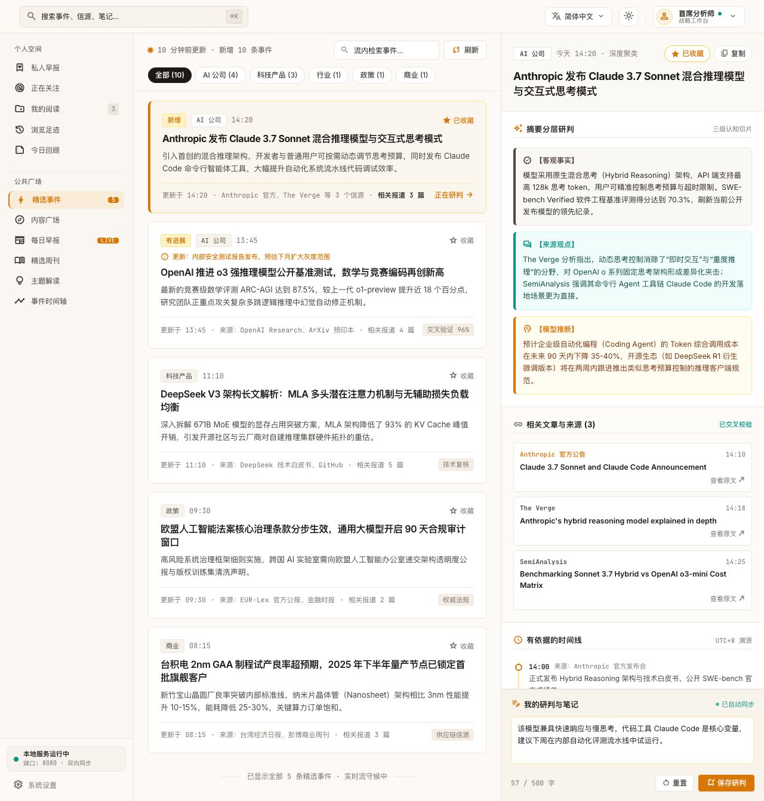
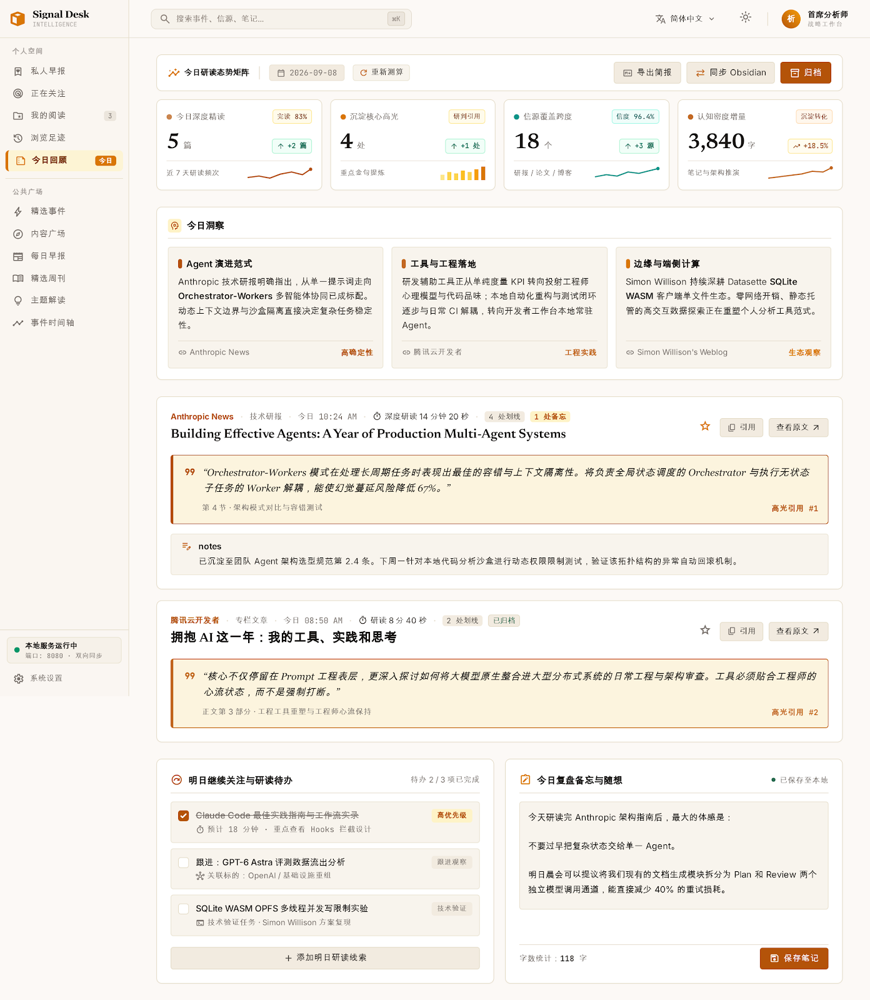
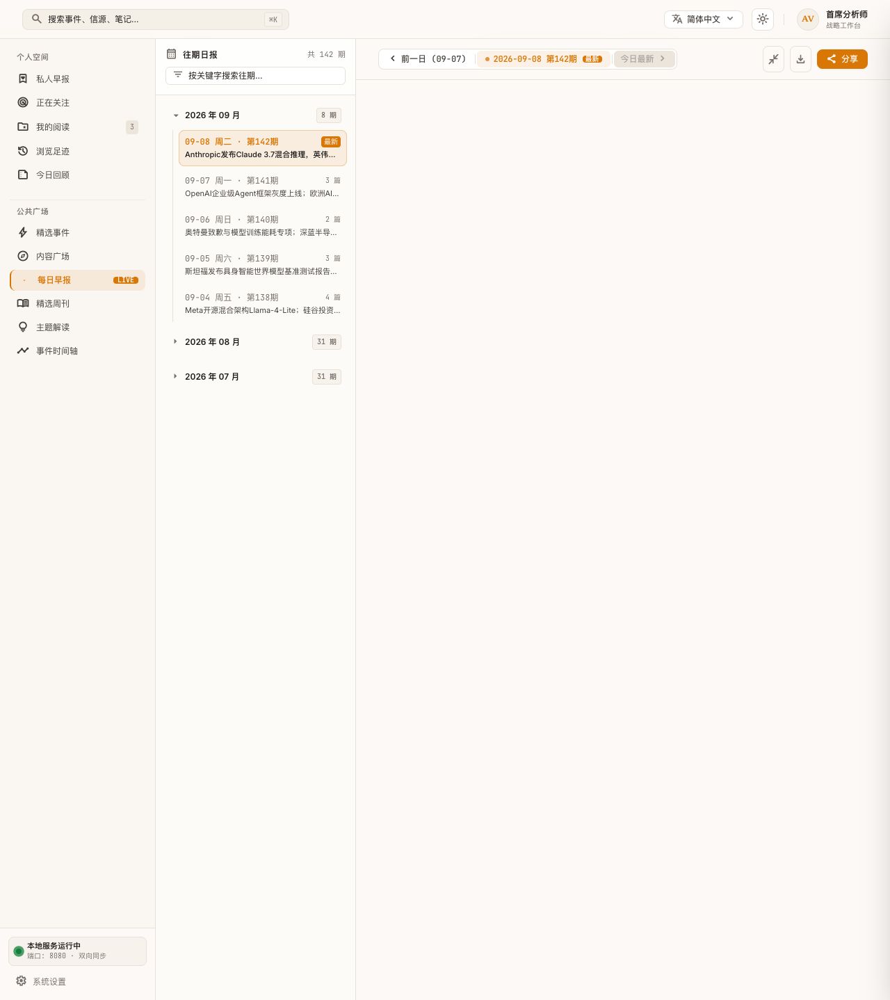
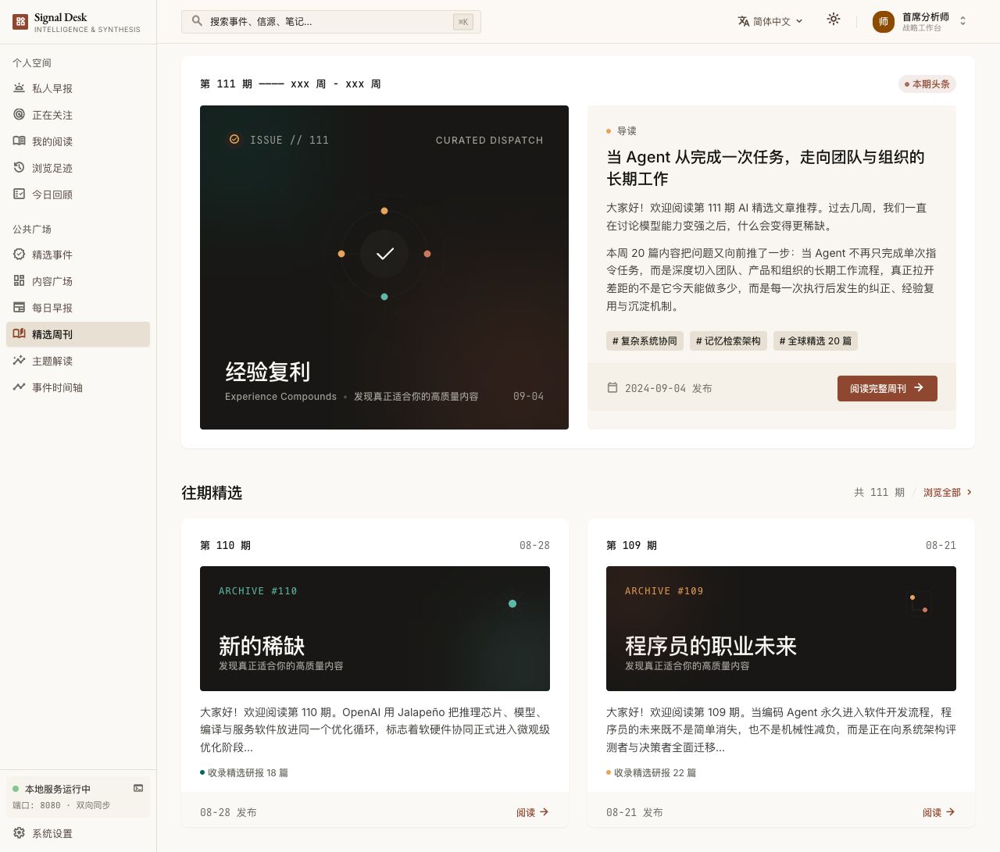
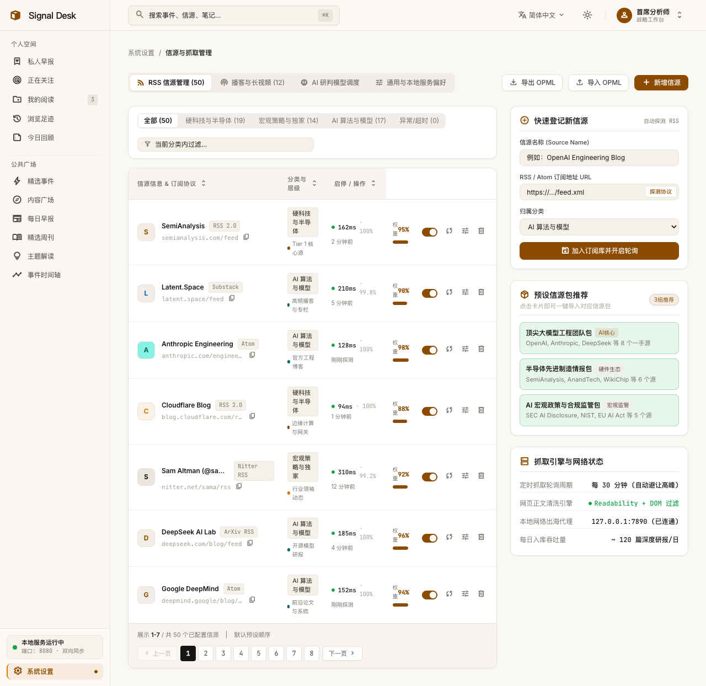
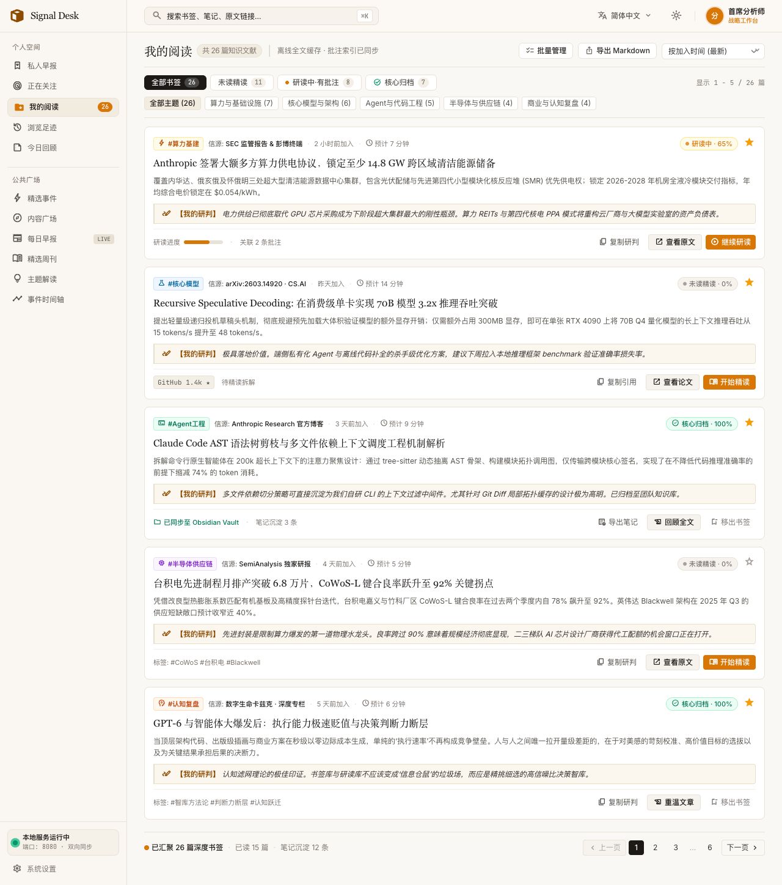
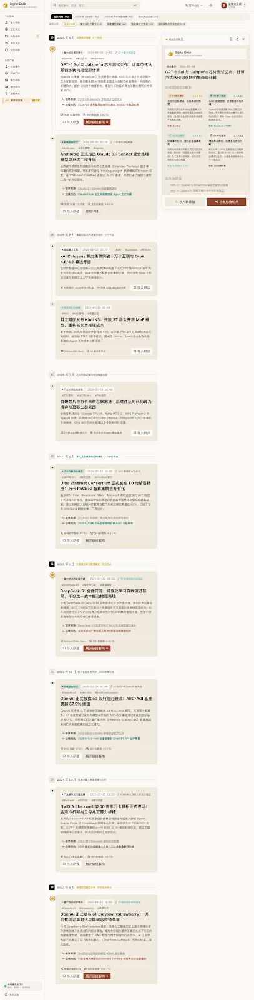

# 📰 Signal Blogs · 私人日报 (暖纸情报研判工作台)

> **围绕你的偏好议题，把“找信息、辨来源、做判断、留记录”接成连续闭环的工作流。**  
> 专为深度阅读者、行业分析师与相关研究者打造的个人严肃情报与研判工作台。  
> 告别冷灰刺眼的算法信息流，拥抱本地知识库沉淀与 100% 本地隐私安全。

<p align="center">
  
  <br />
  <em>▲ 图 1：私人早报高保真原型 —— 晨间导读、置信度量化、今日要闻精读与音频精读联动</em>
</p>

[](https://react.dev/)
[](https://tailwindcss.com/)
[](https://www.sqlite.org/)
[](https://www.electronjs.org/)
[](#-本地优先与隐私安全说明)
[](LICENSE)

---

## ✨ 为什么需要 Signal Blogs？

在算法推荐与营销噪音过载的时代，新闻资讯消费面临三大困扰：
1. **界面同质化与视觉疲劳**：千篇一律的暗黑冷灰“黑客风”界面，长时间高密度阅读极易引发眼部疲劳。
2. **云端遥测与隐私外泄**：个人的关注热点、研读笔记和信源画像被商业平台无声采集与商业化。
3. **事实与观点混淆**：碎片化短讯缺乏上下文证据链，缺少对一手事实（Facts）、来源观点（Takes）与行业底层逻辑的结构化解构。
4. **读过≠记住**：把你读过看过的消息与思考，沉淀为可复用的知识资产。

**Signal Blogs** 重新将“信息主权”交还给读者——运行于本地机器，数据永不出门，提供兼具人文出版美感与严肃分析力度的深度研读环境。

---

## 🏛️ 核心设计原则与功能特性

### 1. 📜 纸质版人文美学
- **温润燕麦纸质感**：摒弃冰冷科技青灰，采用温润燕麦暖纸底色（`#faf8f5` / `#fcf9f6`）、纯白微卡片、深炭墨排印（`#171614`）与 1px 极细发丝分割线（`#e8e3d8`）。
- **学术出版级字系**：报头大标题选用精装衬线体（EB Garamond / Newsreader），正文搭配高可读性无衬线体（Inter），技术指标与编号采用 JetBrains Mono。

---

### 2. 📑 深度研判抽屉：一手事实与来源观点严格区分
针对重点情报一键滑出 560px 沉浸式研读抽屉（支持 `Esc` 退出与键盘流循环）。
- **严格区隔**：一手事实（Facts）、来源观点（Takes）、四维解构（算力 / 工程 / 商业 / 供应链）及原文证据链；
- **500 字本地独立思考笔记**：人工判断与模型分析严格分层，支持一键导出纯净 Markdown，作为后续可复用的个人思考资产。

<p align="center">
  
  <br />
  <em>▲ 图 2：深度研判抽屉 —— 事实、来源观点、模型推断与个人笔记分层研读</em>
</p>

---

### 3. 📊 正在关注与趋势追踪
- **信息矩阵与趋势追踪**：单屏容纳 6~8 组高密情报流，支持按机构、技术栈、资产标签多维组合筛选；
- **信息流降噪**：按加权评分/时间即时重排，一键标记当前筛选结果已读。

<p align="center">
  
  <br />
  <em>▲ 图 3：正在关注 —— 宏观态势矩阵与焦点标签组合过滤流</em>
</p>

---

### 4. ✍️ 今日回顾与沉淀
- **态势矩阵与回顾**：呈现今日精读篇数、完读率、沉淀高光引文数；
- **随想草稿纸与待办清单**：将日常碎片研读沉淀为系统性的研究备忘录。

<p align="center">
  
  <br />
  <em>▲ 图 4：今日回顾 —— 核心洞察提炼、高光划线引文与复盘草稿纸</em>
</p>

---

### 5. 📰 每日早报与往期归档
- **历史早报回溯**：左侧提供按月份折叠的历史早报树形索引，支持前后期无缝穿梭；
- **标准/宽屏阅读模式**：纯粹日报流与研判抽屉联动，支持一键导出单期或整周归档。

<p align="center">
  
  <br />
  <em>▲ 图 5：每日早报 —— 往期日报归档与出版排版</em>
</p>

---

### 6. ⚙️ 信息源管理
- **阅读与配置**：日常阅读界面（私人早报、正在关注）保持纯净，无任何配置杂音与调试按钮；
- **独立信源中台**：RSS/Atom 订阅三列表格管理、Switch 轮询启停、连通性心跳探测与 OPML 一键导入导出，所有信源治理收拢于独立「系统设置」后台。


---

## 产品原型全景画廊

为便于全面了解 Signal Blogs 的信息架构与各模块交互职责，以下展示其余核心工作模块的高保真原型：

| 模块名称与定位 | 高保真原型界面预览 | 核心交互与职责 |
| :--- | :--- | :--- |
| **精选周刊**<br>`/weekly`<br>*深度导读期刊* |  | 精装期刊封面排印、当期核心导读视窗、往期周刊网格归档切换。 |
| **系统设置**<br>`/settings`<br>*信源治理中台* |  | 集中管理 RSS/Atom 订阅管道、Switch 启停轮询与 OPML 导入导出。 |
| **内容广场**<br>`/explore`<br>*全网动态降噪流* |  | 全网科技资讯按最新/权重/多媒体形态筛选，快速捕捉突发态势。 |
| **主题深度解读**<br>`/topics`<br>*产业范式解构* |  | 公司、模型与底层算法横向解耦，呈现跨周期的量化指标对比。 |
| **我的阅读**<br>`/reading`<br>*个人知识文献库* |  | 通栏高密卡片流、本地划线收藏过滤、一键打包导出 Markdown 备忘。 |

---

## 🚀 快速开始

### 环境依赖
- [Node.js](https://nodejs.org/) (推荐 20 LTS 或 24+)
- npm (包版本由 `package-lock.json` 严格锁定)

### 1. 克隆项目与安装依赖
```bash
git clone https://github.com/beiningwuyou/signal-blogs.git
cd signal-blogs
npm ci
```

### 2. 本地 Web 开发模式运行
```bash
# 启动本地服务与 Vite 开发热重载
npm run dev
```
启动成功后，浏览器访问终端输出的本地地址（默认 `http://127.0.0.1:5174` 或 `http://localhost:8080`）。

### 3. 原生桌面客户端运行 (Electron)
```bash
# 构建前端并拉起 Electron 原生桌面窗口
npm run app
```
*提示：按 `Cmd+Q` (macOS) 可完全退出桌面端。*

### 4. 自动化质量验证与测试
```bash
npm run check          # JavaScript 语法与代码规范校验
npm test               # 自动编译并运行 10 项数据存储与过滤测试套件
npm run smoke          # 自动化端到端冒烟测试 (SQLite 重启、深链接等)
npm run smoke:desktop  # 启动 Electron 自动化环境探测
```

---

## 📂 项目结构概览

```text
signal-blogs/
├── src/
│   ├── client/                  # 前端核心源码 (React 19 + Tailwind CSS 3)
│   │   ├── components/          # 通用组件 (Sidebar, Drawer, Card, AudioBar 等)
│   │   ├── pages/               # 11 组核心路由页面 (Daily, Following, Review 等)
│   │   ├── data/                # 主题令牌 theme.json、信源预设与演示情报
│   │   ├── state.jsx            # 本地持久化与 SQLite 双向同步状态流
│   │   └── style.css            # 全局纸质排印与 Amber-Ink 发丝线样式
│   ├── server/                  # 本地轻量后端 (Node.js 原生 HTTP)
│   │   ├── index.js             # 服务启动入口 (支持 --dev 中间件模式)
│   │   ├── db.js                # SQLite 初始化、事务控制与 CRUD
│   │   ├── migrations.js        # 数据库版本迁移引擎
│   │   └── ingestion/           # RSS 解析、网络健康探测、OPML 解析
│   └── shared/                  # 跨端通用常量与类型定义
├── electron/                    # 桌面端主进程 (main.js)
├── data/                        # 本地数据目录 (内置 .gitkeep，已排除用户真实数据库)
├── public/                      # 静态资源与离线字体资源
├── scripts/                     # 统一脚本库 (语法检查、冒烟测试、打包脚本)
├── tests/                       # 核心业务逻辑与数据存储自动化测试套件
├── docs/                        # 统一文档中心 (PRD 交付基准、设计规范、截图资产)
│   ├── assets/screenshots/      # 高保真原型图示资产
│   ├── specs/                   # 产品需求文档 (prd-v1.0.md)
│   ├── design/                  # 设计系统核心规范
│   └── history/                 # 历史演进与立项备忘
├── tailwind.config.js           # Amber-Ink-Editorial 官方设计令牌配置
├── vite.config.js               # Vite 8 构建配置
└── package.json                 # 项目依赖、脚本与元数据
```

---

## 🔒 本地优先与隐私安全说明

- **数据库存放位置**：
  - **浏览器模式**：默认存放在本地 `data/local/signal-blogs.sqlite`。
  - **Electron 桌面模式**：存储于系统原生安全用户目录（macOS 位于 `~/Library/Application Support/Signal Blogs Skeleton/data/`）。
- **零数据追踪**：本项目不包含任何用户分析探针、无第三方 Cookie、不上传任何阅读足迹。
- **环境隔离配置**：可参考 `.env.example` 进行自定义端口或数据路径覆写，所有的私人配置与数据库文件均已被 `.gitignore` 严格屏蔽。
- **演示数据**：开源仓库所附条目为原型演示内容，真实个人订阅与笔记完全生成并保存在你的本地机器中。

---

## 🗺️ 路线图 (Roadmap)

- [x] **Amber-Ink-Editorial** 暖调纸质出版级排版规范
- [x] 每日早报、正在关注、研读抽屉与足迹复盘核心工作台
- [x] SQLite 本地状态双向同步、崩溃恢复与 Markdown 导出
- [x] 信源 CRUD、OPML 导入导出与连通性检测
- [ ] 真实 RSS / Atom 定时轮询与去重增量抓取后台调度器
- [ ] 本地模型（Ollama / 深度研究模型）四维解构与观点摘要接入
- [ ] 跨平台客户端构建（Windows / Linux 安装包与自动化签名流水线）

---

## 🤝 参与贡献 (Contributing)

欢迎提交 Issue 和 Pull Request！在贡献代码前，请确保运行以下命令验证代码质量：
```bash
npm run check
npm test
npm run format:check
```

---

## 📄 开源许可证

本项目采用 [MIT License](LICENSE) 授权。
